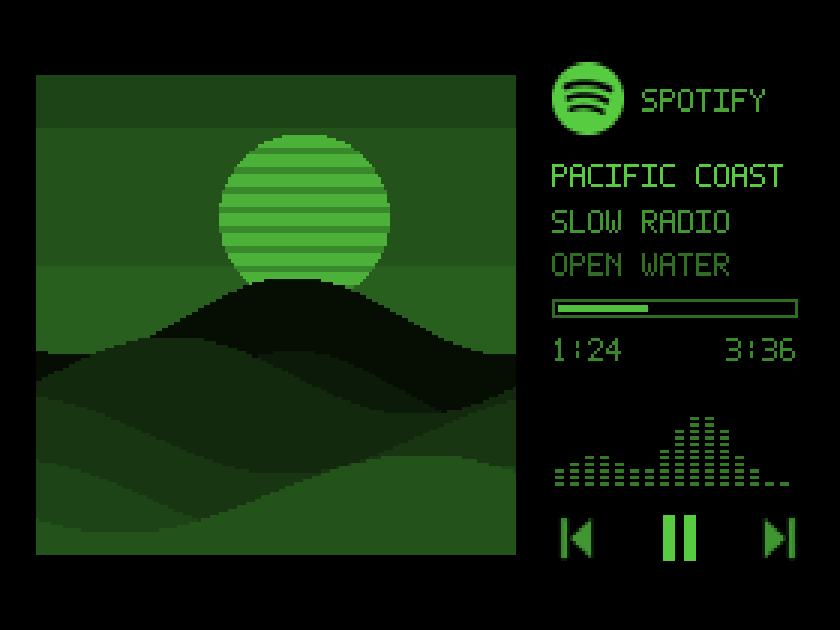

# SpCRTify

A Spotify now-playing display for the Apple Monitor III, powered by a Raspberry Pi Zero 2 W.



*Rendered preview with original demo artwork and fictional track metadata. The Pi outputs grayscale; the monitor supplies the green phosphor glow.*

Large album art, wrapping titles, playback controls, and decorative activity bars in a 280 × 192 picture with 16 luminance levels. The bars animate while playing; they do not analyze the audio. Music plays on your existing Spotify device.

## Try it locally

Requires Python 3.10 or newer.

```sh
git clone https://github.com/yorhodes/spcrtify.git
cd spcrtify
python3 -m venv .venv
. .venv/bin/activate
pip install -r requirements.txt
python app.py
```

Open [127.0.0.1:8765](http://127.0.0.1:8765). Demo mode works immediately. Use **Tune display** to adjust brightness, artwork, and safe edges. Space pauses; the arrow keys skip; C shows calibration.

## Connect Spotify

1. Create an app in the [Spotify developer dashboard](https://developer.spotify.com/dashboard).
2. Register `http://127.0.0.1:8765/callback` as its redirect URI.
3. Click **Connect Spotify**, enter the Client ID, and sign in.

The app owner needs Spotify Premium; additional users must be allowlisted. Sign-in uses PKCE with no client secret. Tokens stay in the ignored `.data/` directory and refresh automatically, including after restarts.

## Run on the Pi

Use Raspberry Pi OS with a desktop, Wi-Fi, SSH, and desktop auto-login.

```sh
sudo apt update
sudo apt install git python3-venv python3-pygame
git clone https://github.com/yorhodes/spcrtify.git ~/spcrtify
cd ~/spcrtify
sh deploy/install.sh
```

The installer sets up automatic startup and a lightweight fullscreen viewer. The Zero 2 W's composite output needs wiring and configuration; follow the [Pi setup guide](docs/pi-setup.md) for video, calibration, and power. Physical Pi / CRT testing is still pending.

To sign in from your laptop, stop the local copy of SpCRTify, then open a tunnel to the running Pi:

```sh
ssh -N -L 8765:127.0.0.1:8765 your-user@raspberrypi.local
```

Open [127.0.0.1:8765](http://127.0.0.1:8765) on your laptop and connect Spotify. The browser is only needed for the initial sign-in. The Pi stores the Client ID and tokens, makes the API calls, and refreshes its own connection. You can close the tunnel afterward.

Leave the Pi powered and use the monitor's power switch. The picture dims after five minutes idle and blanks after thirty; shut down the Pi before unplugging it.

[Development, tests, and alternate sources](docs/development.md) · [MIT license](LICENSE)
